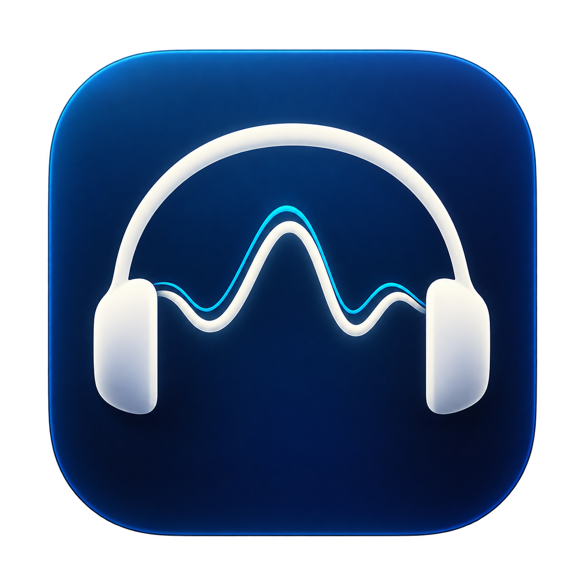

# 共鸣 · AI 歌单



版本：0.2.5

共鸣是一个 macOS 本地工具：用耳机真实频响和歌曲真实 PCM 频谱计算参考偏差，帮助你按歌看耳机，或按一副耳机找歌。结果是声学分析，不是音质评分，也不替代试听。

## 运行

需要 macOS 14.2+、Apple Silicon，以及带 macOS SDK 的 Swift 6 工具链（Xcode 或 Command Line Tools）。

```sh
zsh scripts/build-app.sh
open dist/共鸣.app
```

构建产物是 `dist/共鸣.app`，应用只做本机临时签名，未使用付费开发者签名或公证。运行不需要 Python、ffmpeg、Codex、模型 Token 或 API Key。

## 第一次跑通

1. 打开“我的声学资料库”，点击“使用拉斐尔示例”。应用会载入 HBB 真实右声道曲线（480 点，19.5 Hz–20 kHz）和“平直参考（计算基线）”0 dB 曲线。
2. 平直参考只是计算坐标，不是理想音质目标。你可以导入任意参考曲线并在耳机资料中更换。
3. 用“导入音频…”选择一首本地歌曲，或播放网易云后打开“自动积累听歌资料”进行采集。
4. 在“根据歌曲找耳机”选择歌曲和拉斐尔，查看 D；也可以切到“根据耳机找歌曲”，选择歌曲集合。

只有真实频谱、耳机曲线和参考的实际共同频段才会产生数值。缺资料时页面保留具体说明，不用歌名或标签补推荐。

## 两种模式与结果

“根据歌曲找耳机”比较标记为“我拥有”的耳机；“根据耳机找歌曲”固定一副耳机，对候选歌按一个选中的指标排序：C（谱形变化）、D（参考偏差）或 Dhigh（10–20 kHz 偏差）。只有一副耳机也可以使用。

D 越小表示在所选参考和共同频段内越接近。C 越大表示频谱改变更明显；两者都不等于好听。Dhigh 使用 10–20 kHz 的实际共同数据；高频能量很少或仅覆盖部分频段时仍给估计，并标明能量占比与范围。20 kHz 以上单独展示实际频段证据。

片段、小缺口、候选歌名或 EQ 状态未知时，应用可以按已采内容给出估计，并在结果旁说明限制。测量设备、补偿和播放处理作为备注保留，不因文字不一致直接抹掉可计算结果；曲线范围之外不外推。

## 采集与歌单

本地文件按完整文件导入，并保留原采样率和声道。播放器采集保留原格式和实际录音时长，没有固定 30 秒上限；自动识别可用时随暂停、切歌分段，手动采集需在切歌前点击“停止并分析”。关闭或退出时保存已有录音。无法证明完整覆盖时显示片段或完整度未知，不制造缺失时间。

“自动积累听歌资料”首次开启；手动关闭后会记住，下次启动保持关闭。它只跟随真实播放，不主动切歌或批量播放。网易云不提供辅助功能歌名时，可显式启用窗口识别，应用会记住选择；使用本机 OCR 读取底部歌名和艺人，并读取控制菜单的播放状态。权限不足或采集失败时显示真实错误。

应用可以读取内置网页中已有网易云歌单的可见内容，保留歌曲 ID 和原始顺序，并把真实录音手动绑定到歌单原始行。点击“生成网易云歌单”，预览曲目、连接网易云网页账号并确认创建；应用通过正常网页操作写入，再核对目标歌单。缺少网易云歌曲 ID 的录音可先在资料库绑定链接。桌面客户端和内置网页的登录分别用于采集和建单。本地 JSON 导出仍保留。

2026-09-26，0.2.5 已在真实网易云客户端完成 175.1 秒和 64.5 秒连续采集，48 kHz 双声道、零丢帧，并完成暂停保存、频谱分析和拉斐尔匹配。该版本增加正式图标，并过滤红色 VIP 徽章造成的误切段；横向滚动的长标题仍可能无法稳定自动识别，可改用手动采集。具体证据与范围见 [TESTING.md](TESTING.md)，操作见 [使用说明](使用说明.md)。此前 Core Audio 超时的全部根因尚未查明，本轮采集正常。

创建结果暂时无法核对时，应用保留一次待核对记录，避免自动重复创建。可打开网易云查看、填写目标链接重新核对，或在人工检查后开始新的创建。当前播放有精确歌曲 ID 且本地已有分析时，先展示已有结果，同时继续积累本次录音。

## 验证脚本

```sh
scripts/verify-core.sh
zsh scripts/verify-capture.sh
zsh scripts/verify-capture-cancellation.sh
scripts/verify-listening.sh
zsh scripts/verify-player-ocr.sh
zsh scripts/verify-process-tap.sh
```

这些脚本覆盖曲线导入、PSD、C/D/Dhigh、共同频段和部分覆盖，以及采集缓冲、取消竞态和自动监听策略。实际通过或阻塞情况见 [TESTING.md](TESTING.md)，不要从脚本名称推断产品验收已经完成。

## 数据与来源

资料保存在 `~/Library/Application Support/Resonance`，包括本地元数据、原始音频和频谱文件；关闭应用不会上传音频。

拉斐尔 sample 文件：[Artipical_Raphael_HBB_R.csv](Samples/Raphael/Artipical_Raphael_HBB_R.csv)。

sample 来自 HBB 公开数据：[原始 AudioTools 文件](https://hbb.squig.link/data/Artipical%20Raphael%20R.txt) · [HBB 数据库](https://hbb.squig.link/)。它只有右声道，测量设备与补偿信息以来源备注为准，不代表本项目自行测量；20 kHz 以上没有该 sample 的曲线。

更多操作见 [使用说明](使用说明.md)，完整行为边界见 [产品规格](spec.md)。
